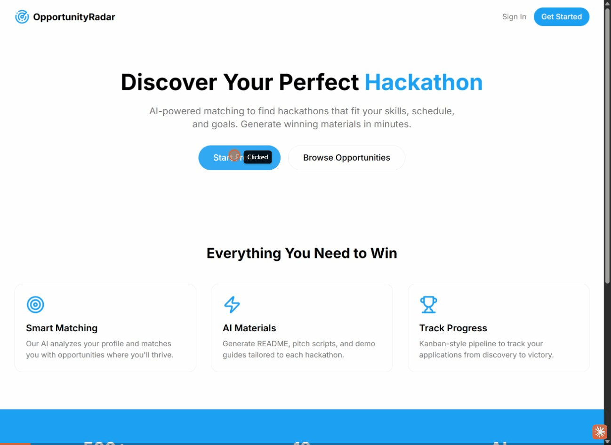

# OpportunityRadar Demo Guide

> AI-powered hackathon opportunity matching and material generation platform

---

## Overview

OpportunityRadar helps developers and teams discover the best hackathons, grants, bounties, and competitions matched to their skills and goals. With AI-powered matching and material generation, users can find opportunities and prepare winning submissions efficiently.

**Key Features:**
- Smart opportunity matching with 4-dimensional scoring
- Kanban-style pipeline management
- AI-powered material generation (README, Pitch, Demo Script, Q&A Prep)
- Profile-based recommendations
- Calendar integration for deadlines

---

## Demo Flow

### 1. Landing Page

The landing page showcases OpportunityRadar's value proposition:
- **"Discover Your Perfect Hackathon"** - Hero section with clear CTA
- **Smart Matching** - AI analyzes your profile for best matches
- **AI Materials** - Generate README, pitch scripts, and demo guides
- **Track Progress** - Kanban-style pipeline management

**Actions:** Click "Start Free" or "Get Started" to begin signup.

---

### 2. Signup Flow

Registration form with:
- Full Name
- Email
- Password & Confirm Password
- OAuth options (GitHub, Google)

**Features demonstrated:**
- Clean split-screen design
- Feature highlights on the right side
- Easy social login options

---

### 3. Dashboard

The personalized command center includes:

| Component | Description |
|-----------|-------------|
| **Profile Completion** | 7-dimension progress tracker (15% shown) |
| **AI Assistant** | Recommended next steps and smart suggestions |
| **Stats Cards** | Total Matches (100), In Pipeline (2), Preparing (1), Won (0) |
| **Top Matches** | High-scoring opportunities with match % |
| **Pipeline Overview** | Visual progress through stages |
| **Upcoming Deadlines** | Calendar view of important dates |

**Guided Tour:** 6-step onboarding tour explains each section.

---

### 4. Opportunities Page

Browse and filter matched opportunities:

**Search & Filters:**
- Debounced search (300ms) with pulse animation
- Status filter: All Matches, Bookmarked, Dismissed
- Type filter: Hackathons, Grants, Bounties, Accelerators, Competitions

**Opportunity Cards:**
- Match score badge (84%, 83%, etc.)
- Type badge (hackathon, bug-bounty)
- Prize pool information
- Eligibility status indicator
- "Quick Prep" button for instant material generation
- "Details" button for full information

---

### 5. Opportunity Details

Detailed view with comprehensive matching analysis:

**Match Score Breakdown (4 Dimensions):**
| Dimension | Score | Description |
|-----------|-------|-------------|
| Relevance | 82% | Semantic match to your profile |
| Eligibility | 100% | Requirements you meet |
| Timeline | 90% | Schedule compatibility |
| Team Fit | 74% | Team size alignment |

**Actions:**
- Bookmark / Dismiss
- Add to Pipeline
- Generate Materials
- Add to Calendar (Google, Outlook, iCal)

---

### 6. Pipeline Management

Kanban-style opportunity tracking:

**Stages:**
1. **Discovered** - New matched opportunities
2. **Preparing** - Active preparation
3. **Submitted** - Applications sent
4. **Pending** - Awaiting results
5. **Won** - Successful outcomes

**Features:**
- Drag-and-drop cards between stages
- Quick move buttons on each card
- Context menu for more options
- Urgency indicators (color-coded borders)

---

### 7. AI Material Generator

Generate winning hackathon materials with AI:

**Material Types:**
| Type | Description |
|------|-------------|
| README | Project documentation |
| 3-min Pitch | Elevator pitch script |
| Demo Script | Live demo guide |
| Q&A Prep | Judge question preparation |

**Form Fields:**
- Project Name (pre-filled from profile)
- Problem Statement
- Your Solution
- Tech Stack (pre-filled from profile)

**Badge:** "Pre-filled from profile" indicates auto-completion.

---

### 8. My Materials

Manage generated materials:
- View all AI-generated content
- Version history with comparison
- Copy to clipboard
- Delete unwanted materials
- Generate new materials

**Empty State:** Prompts user to generate first materials.

---

### 9. Profile Settings

Customize your matching profile:

**Sections:**
- **Profile Type:** Developer, Student, Startup, Designer, Researcher
- **Tech Stack:** 27+ technologies to select
- **Industries:** FinTech, HealthTech, EdTech, Climate, etc.
- **Goals:** Win Prizes, Learn New Skills, Network, Build Portfolio
- **Availability:** Hours per week, team size preference

---

### 10. Settings

Account and app settings:

| Section | Options |
|---------|---------|
| **Connected Accounts** | GitHub, Google OAuth |
| **Data Export** | JSON, CSV formats |
| **Calendar Subscription** | Subscribe to deadlines |
| **Guided Tours** | Replay/reset onboarding tours |

---

## GIF Recordings

The following GIF animations demonstrate key interactions:

| GIF File | Size | Frames | Description |
|----------|------|--------|-------------|
| `01_signup_flow.gif` | 3604KB | 20 | Landing page → Signup form → Account creation |
| `02_onboarding_flow.gif` | 3623KB | 15 | 3-step onboarding with URL extraction (100% quality) |
| `03_dashboard_overview.gif` | 501KB | 3 | Dashboard overview with stats and AI assistant |
| `04_opportunities_search_filter.gif` | 2688KB | 11 | Search "AI" → Filter Hackathons → View Details |
| `05_pipeline_stage_transition.gif` | 655KB | 5 | Kanban drag-drop from Discovered to Preparing |
| `06_ai_generator_material.gif` | 2171KB | 11 | Fill form → Generate README with AI |
| `08_profile.gif` | 168KB | 1 | Profile page with all settings sections |
| `09_settings.gif` | 176KB | 1 | Settings page with connected accounts and tours |

### Screenshots

| Screenshot File | Description |
|-----------------|-------------|
| `01_landing_page.png` | Landing page with hero and features |
| `02_login_page.png` | Login/Signup page |
| `03_dashboard.png` | Dashboard with AI assistant and stats |
| `04_opportunities.png` | Opportunities list with filters |
| `05_pipeline.png` | Pipeline Kanban board |
| `06_ai_generator.png` | AI Material Generator form |
| `07_materials.png` | My Materials page |
| `08_profile.png` | Profile settings page |
| `09_settings.png` | Settings page |

### Recording Notes
- All files are downloaded to Chrome's default Downloads folder
- Move screenshots to `demo/screenshots/` and GIFs to `demo/gifs/` for organization
- Recordings show actual user interactions with real-time AI responses

---

## Technical Highlights

### Match Score Algorithm
- **Semantic Score:** RAG-based profile-to-opportunity matching
- **Rule Score:** Eligibility requirements checking
- **Time Score:** Deadline and availability alignment
- **Team Score:** Team size compatibility

### UI/UX Features
- Framer Motion animations throughout
- Debounced search with visual feedback
- Urgency color system (critical/urgent/warning/safe)
- Responsive design (mobile Pipeline uses stage selector)
- Toast notifications for all actions

### AI Integration
- Profile extraction from website URLs
- Material generation with customizable templates
- Smart suggestions based on pipeline state

---

## Demo Credentials

| Field | Value |
|-------|-------|
| Name | DoxMind Team |
| Email | demo@doxmind.com |
| Password | DemoRadar2024! |

---

## Quick Start

1. Visit `http://localhost:3000`
2. Click "Get Started" to sign up
3. Complete the 3-step onboarding
4. Explore your personalized Dashboard
5. Browse matched Opportunities
6. Add opportunities to your Pipeline
7. Generate AI materials for your submissions

---

## Demo Session Summary

**Recorded:** January 7, 2026

### What Was Demonstrated

| Act | Feature | Recording Type |
|-----|---------|----------------|
| 1 | Landing Page & Signup | GIF + Screenshots |
| 2 | 3-Step Onboarding | GIF (URL extraction: doxmind.com) |
| 3 | Dashboard Overview | Screenshots (Profile 15%, Stats, AI Assistant) |
| 4 | Opportunities | GIF (Search "AI", Filter Hackathons, Details) |
| 5 | Pipeline Kanban | GIF (Stage transition: Discovered → Preparing) |
| 6 | AI Generator | GIF (README generation for DoxMind project) |
| 7 | My Materials | Screenshots (Expanded README view) |
| 8 | Profile & Settings | Screenshots (All sections) |

### Key Highlights Captured

1. **AI-Powered Profile Extraction** - URL `https://doxmind.com` → 100% quality profile extraction
2. **Smart Matching** - 86%, 85%, 85% match scores for top opportunities
3. **4-Dimension Scoring** - Relevance 84%, Eligibility 100%, Timeline 2%, Team Fit 100%
4. **Profile Auto-Fill** - Tech Stack pre-populated in AI Generator
5. **Real AI Generation** - DoxMind README generated with RAG technology description

### Demo Account Created

- **Team:** DoxMind Team
- **Email:** demo@doxmind.com
- **Profile Tech Stack:** TipTap, Vue 3, Tauri, JavaScript/TypeScript, Rust, AI/ML

---

*Generated with OpportunityRadar Demo Recording Tool*
