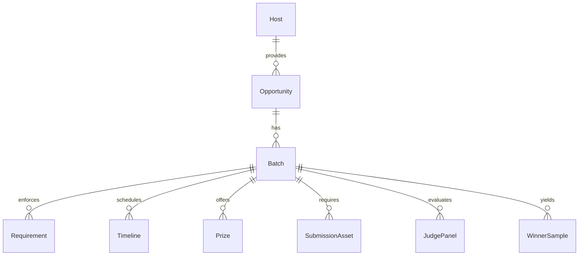

# OpportunityRadar（GrantRadar 2.0）—完整设计文档

> 定位：创业者/开发者的「机会智能雷达」
> 一句话：帮你发现、匹配、准备并拿下所有能让你“加速”的机会——政府资助、Hackathon、创业大赛、加速器、Pitch 比赛。

---

## 0. 文档导读与范围

* 面向对象：产品、工程、数据、增长、运营、法务/合规
* 覆盖范围：目标与指标、用户画像、核心功能、系统架构、数据与算法、产品流程、API/数据模型、非功能性、隐私合规、安全与风控、MVP 计划、路线图、商业化、运维与监控、测试与发布
* 产出标准：**本文件可直接指导 4 周 MVP 落地**，并为 6 个月内的演进提供边界与接口。

---

## 1. 目标（Goals）与北极星指标（North Star）

### 1.1 产品目标

1. **更全**：整合 Grant + Hackathon + 创业大赛/加速器机会，形成统一机会池。
2. **更快**：分钟级新机会发现与推送；截止风险预警。
3. **更准**：基于资格规则 + 语义匹配 + 评审偏好建模，提升入围/中签概率。
4. **更省**：把准备流程产品化（模板与自动化），显著缩短准备工时。
5. **更闭环**：从发现→匹配→准备→提交→结果→回流学习，形成自学习闭环。

### 1.2 北极星指标（及支撑指标）

* 北极星：**月活用户 ×（高匹配机会数/人/月）× 转化率（报名或提交）**
* 关键支撑：

  * 平均准备工时下降（目标：Hackathon 10→3h；Grant 40→8–12h）
  * 错过率（过截止）下降（目标：< 5%）
  * 成功率提升（入围/获批/获奖）（目标：基线+≥2×）
  * 数据时效 SLA（新机会首现→推送 ≤ 15 分钟；关键字段日巡检覆盖率 100%）

---

## 2. 用户画像与核心场景

### 2.1 画像（Personas）

* **Indie Hacker / 学生开发者**：周末/晚间可用时间，偏 Hackathon/大赛；重视组队与材料模板；愿意订阅 Pro。
* **早期初创（Pre-seed/Seed）**：看重政府资助与加速器；关注资格规则、预算模板与里程碑；团队协作与日历整合。
* **高校/加速器管理员**（B2B）：“白标+批量席位”，需要自定义机会池与内部评审台；关注报表与导出。
* **政府/主办方**：希望可信发布与覆盖更多目标群体，关注数据可信度与转化。

### 2.2 核心场景

1. “我是谁”→一次性 Profile；系统持续推送高匹配机会。
2. “我要不要打这场？”→匹配度、资格校验、时间可达性、组队缺口、评审偏好建议。
3. “怎么准备最快？”→一键生成 README/Deck/脚本/预算/大纲，自动嵌入赛事偏好。
4. “不撞车怎么排？”→时间冲突解算与EV（期望收益/学习）排序，自动生成参赛序列。
5. “我赢没赢&为什么”→结果追踪、失败原因结构化回流，模型持续学习。

---

## 3. 功能矩阵（Functional Matrix）

### 3.1 智能发现（Discovery）

* 数据源聚合：

  * **政府基金**：NSERC/SSHRC、NRC-IRAP、SR&ED、FedDev Ontario、各省科技/就业补贴…
  * **Hackathon**：Devpost、MLH、公司官网/大学/社群、AI 专项赛、Kaggle（赛事类）
  * **大赛/加速器**：YC/Techstars/CDL/Web Summit PITCH、天使/VC Demo Day 等
* 抓取策略：爬虫 + RSS + API + 社区众包（主办方/学校渠道）
* 质量信号：**机会质量分（OQS）**（主办信誉、履约历史、投诉率、奖金真实性、页面更新频次）
* 新鲜度：分钟级发现；**关键字段日巡检**（截止日、提交入口、FAQ、资格条款）

### 3.2 智能匹配（Matching）

* Profile 一次性录入（类型、阶段、技术栈、行业、团队规模、地点、可用时间、语言、战绩、目标）
* 匹配得分 S（详见 §6）与**不匹配原因 Top3**（可修复建议）
* **资格 DSL** 硬约束校验（地区/身份/规模/学籍/团队人数/商业注册等）
* **时间可达性与冲突解算**（Deadline × 预计准备工时 × 可用时段 → 可行概率）
* **组队匹配**（缺口角色/时段/合规要求）

### 3.3 智能准备（Preparation）

* **Hackathon**：README 模板、Demo Script、Lightning talk（1/3/5 分钟）、评委 Q&A 预测
* **政府基金**：按官方格式的申请书大纲、预算表向导（可报销/不可报销标注）、里程碑计划
* **创业大赛/加速器**：1-min 电梯稿、3/5-min Deck、基础财务模型模板（收入/成本/现金流）
* **评审偏好引擎**（历史获奖样本与评委画像→偏好雷达注入生成物结构）

### 3.4 智能追踪（Tracking）

* **机会管道**：发现中 → 准备中 → 已提交 → 待定 → 已获得/未中
* **截止雷达**：按 D-天排序的提醒；变更预警（入口变动/FAQ 变化）
* **结果回流**：成功/失败原因结构化（资格驳回点、评分维度短板、材料缺项）→模型学习

### 3.5 协作与日历

* 团队共享看板、任务分配、进度可视化
* Google/Outlook Calendar 双向同步（截止/里程碑）
* 版本化材料库（模板实例可复用/迭代）

---

## 4. 系统架构（Architecture）

### 4.1 组件拓扑

* **Ingestion 层**：爬虫（Playwright/Colly/Scrapy）、RSS/官方 API、社区提交入口
* **Normalization & KG**：清洗/去重/冲突消解 → 统一 Schema → **机会知识图谱（Opportunity KG）**
* **Rule Engine**：**资格 DSL** 编译与执行（硬约束）
* **Matching & Ranking**：语义向量检索（机会文本/主题/标签）+ 规则加权 + 时间/团队可行性 + 偏好拟合
* **Preparation Generator**：模板/提示词（prompt）→ 条件化生成 → 合规检查（格式校验）
* **Scheduling & Alerts**：截止雷达、日巡检、异常回滚
* **APIs**：GraphQL/REST（Web/移动/白标）
* **Front-end**：Next.js/React + Tailwind（Dashboard、管道、日历、材料生成器）
* **Storage**：PostgreSQL（交易与元数据）+ S3/GCS（文档与静态）+ 向量库（Qdrant/Weaviate/PG-Vector）+ OpenSearch/Elastic（全文与聚合）
* **Async**：Kafka/Redis Streams + Celery/Arq（抓取、日巡、训练、批处理）
* **Infra**：Kubernetes（多队列、定时任务、HPA）、Vault（密钥）、ArgoCD（部署）
* **Observability**：OpenTelemetry + Prometheus/Grafana + Loki（日志）

### 4.2 数据流（高层）

1. 抓取器写入 RawEvents → 清洗/抽取 → Upsert 到 KG + 索引更新
2. 用户 Profile 更新触发 **反向推送**（近似最近邻 + 规则校验）
3. 生成器按「机会画像卡 + 偏好雷达」产出材料草稿 → 存储版本
4. 结果写回：更新样本库与偏好模型

---

## 5. 数据模型（Schemas）

### 5.1 机会知识图谱（核心实体）



#### 5.1.1 表/集合（简化）

* `hosts(id, name, type, country, website, reputation_score)`
* `opportunities(id, host_id, category, title, desc, tags[], industry[], tech_stack[], locale[], credibility, created_at, updated_at)`
* `batches(id, opp_id, year, season, remote_ok, region[], team_min, team_max, student_only bool, startup_stage[], sponsor[])`
* `requirements(id, batch_id, kind, expression_dsl, notes)`
* `timelines(id, batch_id, opens_at, closes_at, demo_at, result_at, timezone)`
* `prizes(id, batch_id, prize_type, amount, currency, benefits[])`
* `submission_assets(id, batch_id, kind, format, required bool, max_len, template_ref)`
* `judge_panels(id, batch_id, judge_names[], weights_json)`  // 可控格（完成度/创新/影响…）
* `winner_samples(id, batch_id, link, assets[], features_json, label_json)` // 用于偏好学习
* `quality_signals(id, batch_id, freshness_score, update_freq, complaints_ratio, payout_reliability)`

### 5.2 用户与团队

* `users(id, email, hashed_pwd, name, location, tz, languages[], roles[])`
* `teams(id, name, owner_id, size, calendar_id, plan)`
* `profiles(id, user_id, type, stage, tech_stack[], industry[], team_size, location, availability_json, languages[], wins[], intents[])`

`availability_json` 示例：

```json
{
  "time_blocks": [
    {"dow": "Sat", "start": "09:00", "end": "18:00"},
    {"dow": "Sun", "start": "09:00", "end": "18:00"},
    {"dow": "Wed", "start": "19:00", "end": "22:00"}
  ]
}
```

### 5.3 匹配与追踪

* `matches(id, profile_id, batch_id, score, reasons_json, status, created_at)`
* `pipelines(id, team_id, stage, batch_id, owner_id, eta_hours, deadline_at)`
* `results(id, pipeline_id, outcome, score_breakdown_json, rejection_reasons[], feedback_text, attachments[])`

---

## 6. 匹配/排序与偏好模型

### 6.1 资格 DSL（硬约束）

* 形式：可执行谓词组合

  * `region in ["Ontario", "Canada"]`
  * `team.size >= 3`
  * `profile.type in ["startup","student"]`
  * `startup.stage in ["pre-seed","seed"]`
  * `student_only implies profile.type=="student"`

示例（DSL JSON）：

```json
{
  "all": [
    {"op": "region_in", "args": [["Ontario","Canada"]]},
    {"op": "team_min", "args": [3]},
    {"op": "type_in", "args": [["startup","student"]]}
  ]
}
```

### 6.2 评分公式（首版）

```
S = α·Sim_sem + β·HardFit + γ·PrefFit + δ·TimeFeas + ε·TeamFit + ζ·PastWin
```

* `Sim_sem`：机会文本/主题/标签与用户 Profile 的向量相似度
* `HardFit`：资格 DSL 满足率（0/1/分项）
* `PrefFit`：评审偏好拟合度（见下）
* `TimeFeas`：时间可达性（截止 - 预计工时 - 可用时段 → 可行概率）
* `TeamFit`：团队构成适配（角色/数量/合规要求满足程度）
* `PastWin`：同主办/同主题/同类型赛事过往成绩加权

参考权重（MVP）：`α=0.35, β=0.25, γ=0.15, δ=0.10, ε=0.10, ζ=0.05`

### 6.3 评审偏好引擎（Preference Model）

* 样本：往届获奖/入围项目的 deck/demo/README + 公开评语/评委访谈（可抓取/用户贡献）
* 特征抽取（示例）：

  * 是否有**可交互 Demo**；用户验证/试点证据；技术新颖度 vs 工程完成度；影响/市场规模；可持续性；伦理/合规；说明文档质量
* 学习目标：拟合每一机会/主办/评委的**权重向量**（如：完成度 0.6 / 创新 0.3 / 影响 0.1）
* 应用：在材料生成时做**条件化模板**注入；在匹配评分中作为 `PrefFit`

---

## 7. 产品流程（User Flows）

### 7.1 首次上手

1. 注册→导入/填写 Profile
2. 选择目标（资金/曝光/组队等）与可用时间
3. 立即获得“本周高匹配机会 Top N”（带不匹配原因与修复方案）

### 7.2 决策页（单机会）

* **机会画像卡**：

  * 基本要素（类别/奖金/时区/远程/团队人数）
  * **资格硬约束**（绿色/红色标签）
  * **偏好雷达**（完成度/创新/影响/演示）
  * **时间可达性**（预计工时、冲突热力图）
  * **EV 建议**（赢面 × 奖金/权益 × 学习价值）
* 动作：加入管道 / 生成材料 / 组队 / 日历同步

### 7.3 生成材料

* 弹窗选择：目标版本（1/3/5 分钟）、语言、是否强调 demo、是否附用户证据
* 输出：README、Deck 大纲（章节与要点）、演讲稿、Demo Script、预算模板（政府基金）、Q&A 预测
* 注：所有输出**结构化**（Markdown/JSON），可复用与版本化

### 7.4 追踪与提醒

* Pipeline 看板（看板流转 + 子任务）
* 截止雷达（D-3/D-1/变更即时）
* 结果回填（原因/评分/评语）→ 个性化改进建议

---

## 8. 前后端接口（API）与示例

### 8.1 REST/GraphQL（建议：REST for ingestion & auth，GraphQL for read）

**示例 REST Endpoints**

* `POST /v1/auth/signup|login|logout`
* `GET /v1/opportunities?category=hackathon&region=ON&sort=freshness`
* `GET /v1/opportunities/{id}/batches/{batch_id}`
* `POST /v1/profile`（或 `PUT /v1/profile`）
* `GET /v1/match?profile_id=...&limit=20`
* `POST /v1/pipeline`（加入管道）
* `POST /v1/generate/materials`（body: {batch_id, profile_id, targets[]})
* `POST /v1/result`（结果回填）
* `GET /v1/calendar/export.ics`（订阅式）

**生成材料请求示例**

```json
{
  "batch_id": "b_2025_anthropic_01",
  "profile_id": "p_abc",
  "targets": ["readme", "pitch_3min", "demo_script", "qa_pred"],
  "language": "en",
  "constraints": {
    "highlight_demo": true,
    "time_limit_min": 180
  }
}
```

**响应（片段）**

```json
{
  "readme_md": "## Project Name\n### Problem...\n",
  "pitch_md": "# 3-min Pitch\n- Hook: ...\n",
  "demo_script_md": "Step 1: Open...\n",
  "qa_pred_md": "- Q: How will you scale?\n  A: ..."
}
```

---

## 9. 技术栈（推荐）

* **前端**：Next.js + React、Tailwind、shadcn/ui、framer-motion
* **后端**：Python + FastAPI（或 Node.js + NestJS）
* **数据**：PostgreSQL、Redis、S3/GCS、OpenSearch/Elastic、Qdrant/Weaviate/pgvector
* **爬虫**：Playwright + Scrapy、Airflow/Prefect（调度可选）、Apify（可选）
* **LLM/生成**：可插拔（自管/云），保留 Function/Structured 输出；模板引擎（Jinja2/Prompt injection safe wrappers）
* **Infra**：K8s + ArgoCD + Helm、Vault、Prometheus/Grafana、Loki、OpenTelemetry
* **Auth**：JWT/OAuth2、SAML（企业版可选）

---

## 10. 非功能性（NFRs）

* **性能**：搜索/匹配 API P95 < 300ms；生成任务排队 < 10s；新机会推送延迟 ≤ 15 分钟
* **可用性**：SLA 99.9%；核心数据多副本；巡检失败自动降级
* **可观测性**：端到端 Tracing；全链路指标与告警
* **可扩展**：数据源适配器可插拔；评分器参数化；生成模板可版本化

---

## 11. 隐私、合规与数据来源

* **数据来源合规**：遵守网站 ToS 与 robots.txt；优先官方 API/RSS；对页面结构波动设置低频拉取 + 高价值页面白名单；对争议性源标注“低可靠性”。
* **最小化收集**：仅存储匹配/生成所需字段；敏感信息（如身份证明/雇佣计划）默认本地化加密存储，严禁无关用途。
* **加密**：传输 TLS1.2+；静态数据 KMS 加密；密钥管理用 Vault。
* **访问控制**：RBAC（用户、团队、机构）；审计日志全量保留（≥ 1 年）。
* **AI 使用声明**：在材料模板内提供“AI 协助声明”选项；提供原创性清单（数据来源、引用、代码片段出处）。

---

## 12. 安全与风控

* **防刷/爬虫反制**：访问频控、签名校验、图形化挑战（仅对匿名接口）
* **注入与滥用**：模板参数化、提示词沙箱、输出校验（长度/格式/敏感词）
* **DDoS/CDN**：前置 CDN + WAF；关键 API 限流
* **数据完整性**：时间线/资格条款必须有“最后核验时间戳”；冲突来源→人工复核队列

---

## 13. 评测与指标（Evaluation）

### 13.1 离线评测

* 语义检索：nDCG@k、MRR；
* 资格校验：精确率/召回率；
* 偏好拟合：与历史评分/获奖标签的一致性（AUC/F1）
* 评分器消融实验：移除各项权重对最终命中率的影响

### 13.2 在线实验（A/B）

* 转化率（点击→加入管道→提交）
* 准备工时（自报 + 客观编辑时长）
* 成功率与错过率
* 召回质量（用户人工标注“无关/相关/非常相关”）

---

## 14. 商业化与增长（Monetization & Growth）

### 14.1 分层定价

* Free：每周 3 个匹配推送、基础筛选、基础提醒
* Pro（$19/月）：无限匹配、材料生成、截止雷达、结果回流建议
* Team（$49/月）：多人协作、组队匹配、共享日历、模板共享
* Enterprise（$299/月 起）：白标、API、机构看板、批量席位、SAML、专属数据源

### 14.2 B2B 通道

* 高校创业中心/加速器白标（自有机会池 + 内部评审）
* 主办方**可信发布**徽章与“标准化 feed”，置换曝光与数据回流

### 14.3 增长飞轮

高频 Hackathon → 数据与偏好快速学习 → 生成物与建议更准 → 成功率提升 → 口碑与复用 → 反哺长周期 Grant 成功率

---

## 15. MVP 计划（4 周落地）

**Week 1–2：数据层**

* 接入 Devpost、MLH、3 个加拿大政府基金（NSERC/IRAP/FedDev/Ontario 中选 3）
* 建立统一 Schema 与 Opportunity KG；实现去重与冲突消解
* 建“截止雷达”与关键字段日巡检

**Week 3：匹配层**

* 完成 Profile 表单 + 可用时段
* 语义向量（text-embedding）+ 资格 DSL 校验
* 首版评分器（S）+ 不匹配 Top3 + 修复建议
* 简单组队匹配（人数/角色/时间缺口）

**Week 4：生成 & 追踪**

* Hackathon：README + 3 分钟 Pitch + Demo Script + Q&A 预测
* Grant：申请书大纲 + 预算向导（可报销/不可报销标签）
* Dashboard/管道 + 截止提醒（邮件/站内）
* 结果回流表单 + 简单建议生成

---

## 16. 路线图（6 个月）

* M2：偏好引擎 v1（往届样本自动抽取）/ 机会质量分（OQS）
* M3：机构白标 + 主办方可信发布；多语言（EN/ZH 起步）
* M4：时间冲突解算器 v2（EV/收益与学习权重）+ 自动参赛序列
* M5：模板市场（社区贡献与评分）+ 自动法务检查（条款映射）
* M6：移动端（PWA）+ 第三方集成（Notion/Slack/Linear）+ 扩展更多地区/类别

---

## 17. 关键页面线框（描述）

1. **机会列表**：左侧筛选（类别/地区/远程/截止）；右侧卡片含匹配度、OQS、截止倒计时、偏好雷达小图
2. **机会详情**：画像卡 + 资格标签 + 时间可达性 + 不匹配修复 + 生成材料按钮
3. **生成器**：目标选择（README/Deck/Script/预算）+ 条件化选项（强调 demo/证据）→ 右栏预览
4. **管道看板**：五列（发现/准备/已提交/待定/已获得）；卡片显示负责人、ETA、提醒
5. **设置/团队**：Profile、可用时段、角色技能、日历授权；团队成员管理

---

## 18. 测试计划（QA）

* **单元**：DSL 解析、时间解算、向量检索、模板渲染
* **集成**：抓取→清洗→KG→检索→匹配→生成→保存 全链路
* **回归**：高价值源页面结构变更的监控用例
* **数据一致性**：截止/入口/必交材料的“人工抽检 5%/日”
* **安全**：注入/越权/速率限制/对象存储访问策略

---

## 19. 运维与监控（Ops）

* 指标：抓取成功率、页面结构异常率、数据延迟、巡检命中率、匹配延迟、生成排队时延
* 告警：基于阈值/异常波动（如某源 5xx 激增、截止字段变动率异常）
* 灰度：数据源/模板/评分权重可灰度发布；回滚按钮
* 备份：Postgres 日备；S3 版本化；向量索引定期快照

---

## 20. 风险与应对

* **数据源波动/封禁**：优先官方/合作；速率控制；结构化备份与代理池；与主办方建立“可信发布”
* **法律合规**：严格 ToS；争议页面仅保留元数据与跳转；不缓存受限正文
* **生成依赖**：多提供商冗余；降级策略（模板 + 手填项提示）
* **冷启动**：校园/加速器白标换样本库；主办方可信发布；用户众包校验激励（积分）

---

## 21. 交付件清单（MVP 必备）

* 统一 Schema 与数据库迁移脚本（Postgres + pgvector）
* 抓取器 6 个（Devpost/MLH/NSERC/IRAP/省级基金X2）
* 资格 DSL 执行器（含单测样例 50 条）
* 匹配 API（含不匹配原因与修复）
* 生成器模板（Hackathon README/3-min Pitch/Demo Script；Grant 大纲/预算向导）
* Dashboard 前端（列表/详情/管道/提醒）
* 观测面板（Grafana 仪表：抓取/延迟/错误率/推送 SLA）

---

## 22. 附录：示例模板与伪代码

### 22.1 匹配伪代码（Python）

```python
def match_score(profile, batch, pref_vec):
    sim_sem = cosine(embed(profile), embed(batch))
    hard = dsl_eval(batch.requirements, profile)
    time_feas = time_feasibility(profile.availability, batch.timeline, est_hours=batch.eta_hours)
    team_fit = team_compat(profile.team, batch.team_min, batch.team_max, required_roles=batch.roles)
    past_win = past_win_score(profile.past_wins, batch.host, batch.category)
    pref_fit = cosine(profile.intent_vector, pref_vec)  # learned from winners
    α,β,γ,δ,ε,ζ = 0.35,0.25,0.15,0.10,0.10,0.05
    return α*sim_sem + β*hard + γ*pref_fit + δ*time_feas + ε*team_fit + ζ*past_win
```

### 22.2 README 生成（条件化片段）

```jinja2
## Problem
{{ problem_statement }}

## Why now

Focus on a working demo with {{ demo_targets }} and measurable KPIs.

Highlight novelty: {{ novelty_points }}.


## Demo Plan ({{ demo_time }} mins)
1. {{ step1 }}
2. {{ step2 }}
3. {{ step3 }}
```

### 22.3 预算向导（政府基金）

```json
{
  "personnel": [{"role":"ML Engineer","months":6,"rate":6000,"eligible":true}],
  "cloud": [{"item":"GPU credits","months":4,"cap": "per_policy_3_2", "eligible": true}],
  "equipment": [{"item":"Edge devices","eligible": false}],
  "travel": [{"item":"Demo Day","eligible": true}],
  "summary": {"eligible_total": 30000, "ineligible_total": 5000}
}
```

---

## 23. 成功定义（Definition of Done, MVP）

* 数据：≥ 1000 个有效机会（含近 90 天内活跃）
* 用户：≥ 100 位 Beta（≥ 30% 每周活跃）
* 匹配：人工评估“相关/很相关”≥ 70%
* 生成：≥ 50% 用户完整提交使用我们模板/大纲
* 时效：新机会推送延迟 ≤ 15 分钟，日巡检覆盖 100% 核心字段
* 安全与合规：通过内部审计清单（ToS、隐私、日志、访问控制）

---
