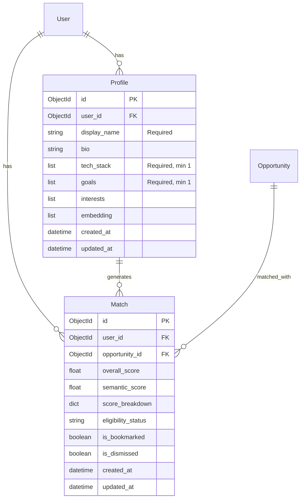

# feat: 完整用户教学引导流程 (Onboarding Tutorial Flow)

## Overview

创建完整的用户 onboarding 教学流程，解决当前系统的核心问题：用户完成注册后 Profile 数据为空、无法生成 matches、前端 opportunities 页面显示空白。

### 当前问题

| 问题 | 影响 | 严重程度 |
|------|------|----------|
| **Frontend/Backend API 数据契约不匹配** | 即使计算成功，UI 显示空白/NaN | **🔴 Blocker** |
| Profile 确认后不触发 matches 计算 | 用户完成 onboarding 却看到空白列表 | **Critical** |
| Profile 无必填字段验证 | 用户可跳过关键信息，导致 embedding 质量差 | **Critical** |
| 无产品导览 (Product Tour) | 新用户不知如何使用各功能 | **High** |
| 空状态提示不友好 | 用户困惑，不知下一步该做什么 | **High** |
| `matching_service.py` 使用 PostgreSQL 但系统是 MongoDB | 代码无法运行（应使用 MongoMatchingService） | **Critical** |

### 目标

1. 用户完成 onboarding 后自动看到匹配的 opportunities
2. 首次使用时有清晰的产品导览
3. 空状态页面引导用户采取正确行动
4. Profile 必填字段确保匹配质量

### 实现优先级 (Codex Review 建议)

```
Phase 0: API 契约修复 ← 🔴 必须先做，否则后续全部无效
   └─ /matches/top 返回 enriched 数据 (score, batch_id, opportunity_title, deadline)
   └─ /matches/status 端点支持轮询

Phase 1: Match 计算触发 + 前端轮询
   └─ onboarding confirm → BackgroundTasks 计算
   └─ Step3 轮询 matches 直到可用

Phase 2: 空状态组件
   └─ EmptyState 组件 + 动态 CTA

Phase 3: Profile 更新重算
   └─ 关键字段变更 → 重新计算 matches

Phase 4: 产品导览 (Product Tour)
   └─ 内容稳定后再添加导览
```

---

## Problem Statement / Motivation

### 用户故事

> 作为新注册用户，我希望完成简单的引导流程后，立即看到与我技能匹配的机会列表，这样我可以快速发现有价值的 hackathon、grant 或 accelerator。

### 当前用户旅程 (存在问题)

```
1. 注册 → 2. 输入 URL → 3. 确认 Profile → 4. 查看 Matches (空白!) → 5. 进入 Dashboard (空白!)
```

### 期望用户旅程

```
1. 注册
   → 2. 输入 URL (或跳过手动填写)
   → 3. 确认 Profile (必填字段验证)
   → 4. 等待 Matches 计算 (后台异步)
   → 5. 查看 Top Matches (3-5 个真实匹配)
   → 6. 进入 Dashboard
   → 7. 首次访问触发产品导览 (Driver.js)
   → 8. 完成导览，开始使用
```

---

## Proposed Solution

### 架构概览

```
┌─────────────────────────────────────────────────────────────────┐
│                        Frontend (Next.js)                        │
├─────────────────────────────────────────────────────────────────┤
│  ┌──────────────┐  ┌──────────────┐  ┌──────────────────────┐   │
│  │ Onboarding   │  │ Dashboard    │  │ Product Tour         │   │
│  │ (3 Steps)    │  │ (Empty State)│  │ (Driver.js)          │   │
│  └──────┬───────┘  └──────┬───────┘  └──────────┬───────────┘   │
│         │                 │                      │               │
│  ┌──────▼─────────────────▼──────────────────────▼───────────┐   │
│  │                    Zustand Stores                          │   │
│  │  - onboarding-store (profile data, step)                  │   │
│  │  - tour-store (NEW: tour completion state)                │   │
│  └──────────────────────────┬────────────────────────────────┘   │
│                             │                                    │
│  ┌──────────────────────────▼────────────────────────────────┐   │
│  │                    API Client                              │   │
│  │  - confirmProfile() → triggers match calculation          │   │
│  │  - getMatches() / getTopMatches()                         │   │
│  └──────────────────────────┬────────────────────────────────┘   │
└─────────────────────────────┼────────────────────────────────────┘
                              │
┌─────────────────────────────▼────────────────────────────────────┐
│                        Backend (FastAPI)                          │
├───────────────────────────────────────────────────────────────────┤
│  ┌──────────────┐  ┌──────────────┐  ┌──────────────────────┐    │
│  │ /onboarding  │  │ /matches     │  │ BackgroundTasks      │    │
│  │ /confirm     │  │ /calculate   │  │ (Match Computation)  │    │
│  └──────┬───────┘  └──────┬───────┘  └──────────┬───────────┘    │
│         │                 │                      │                │
│  ┌──────▼─────────────────▼──────────────────────▼───────────┐    │
│  │                  MongoMatchingService                      │    │
│  │  - compute_matches_for_profile()                          │    │
│  │  - save_matches()                                         │    │
│  └──────────────────────────┬────────────────────────────────┘    │
│                             │                                     │
│  ┌──────────────────────────▼────────────────────────────────┐    │
│  │                    MongoDB (Beanie)                        │    │
│  │  - Profile, Match, Opportunity documents                  │    │
│  └───────────────────────────────────────────────────────────┘    │
└───────────────────────────────────────────────────────────────────┘
```

---

## Technical Approach

### Phase 0: API Contract Fixes (最高优先级 - 不修复则后续无效)

> ⚠️ **CRITICAL**: 前端期望的字段与后端返回的字段不匹配。即使 matches 计算成功，UI 也会显示空白/NaN。必须首先修复！

#### 0.1 Frontend/Backend 数据契约修复

**问题分析**:

| 前端期望字段 | 后端返回字段 | 影响 |
|-------------|-------------|------|
| `match.score` | `overall_score` | 分数显示 NaN |
| `match.batch_id` | `opportunity_id` | 路由跳转失败 |
| `match.opportunity_title` | ❌ 不存在 | 标题显示空白 |
| `match.opportunity_category` | ❌ 不存在 | 类别显示空白 |
| `match.deadline` | ❌ 不存在 | 截止日期缺失 |

**文件**: `src/opportunity_radar/api/v1/endpoints/matches.py`

```python
from beanie.operators import In
from ....models.opportunity import Opportunity

@router.get("/top")
async def get_top_matches(
    limit: int = Query(10, ge=1, le=50),
    current_user: User = Depends(get_current_user),
):
    """
    Get top N matches with enriched opportunity data.
    Returns the highest scoring matches that are not dismissed.
    """
    matches = await Match.find(
        Match.user_id == current_user.id,
        Match.is_dismissed == False
    ).sort(-Match.overall_score).limit(limit).to_list()

    # Fetch related opportunities in bulk
    opp_ids = [m.opportunity_id for m in matches]
    opps = await Opportunity.find(In(Opportunity.id, opp_ids)).to_list()
    opp_by_id = {o.id: o for o in opps}

    # Enrich matches with opportunity data
    items = []
    for m in matches:
        opp = opp_by_id.get(m.opportunity_id)
        items.append({
            **m.model_dump(mode="json"),
            # Frontend compatibility aliases
            "score": m.overall_score,
            "batch_id": str(m.opportunity_id),
            # Enriched opportunity data
            "opportunity_title": opp.title if opp else None,
            "opportunity_category": opp.opportunity_type if opp else None,
            "deadline": opp.application_deadline.isoformat() if opp and opp.application_deadline else None,
            "opportunity_url": opp.url if opp else None,
        })

    return {"items": items, "count": len(items)}
```

#### 0.2 添加 Match 计算状态端点

**文件**: `src/opportunity_radar/api/v1/endpoints/matches.py`

```python
@router.get("/status")
async def get_match_status(
    current_user: User = Depends(get_current_user),
):
    """
    Get match calculation status for current user.
    Used by frontend polling to know when matches are ready.
    """
    total_count = await Match.find(Match.user_id == current_user.id).count()
    profile = await Profile.find_one(Profile.user_id == current_user.id)

    has_profile = profile is not None
    has_embedding = profile and profile.embedding is not None

    return {
        "has_profile": has_profile,
        "has_embedding": has_embedding,
        "match_count": total_count,
        "status": "ready" if total_count > 0 else ("calculating" if has_embedding else "no_profile"),
    }
```

---

### Phase 1: Critical Blockers (必须修复)

#### 1.1 Profile 确认后自动计算 Matches

**文件**: `src/opportunity_radar/api/v1/endpoints/onboarding.py`

```python
from fastapi import BackgroundTasks

async def compute_matches_background(user_id: str, profile_id: str):
    """后台异步计算 matches"""
    from ....services.mongo_matching_service import MongoMatchingService
    service = MongoMatchingService()
    matches = await service.compute_matches_for_profile(profile_id, limit=100, min_score=0.0)
    await service.save_matches(user_id, matches)

@router.post("/confirm", response_model=OnboardingConfirmResponse)
async def confirm_profile(
    request: OnboardingConfirmRequest,
    background_tasks: BackgroundTasks,  # 新增
    current_user: User = Depends(get_current_user),
):
    service = get_onboarding_service()
    profile = await service.confirm_profile(current_user, request)

    # 新增: 后台计算 matches
    background_tasks.add_task(
        compute_matches_background,
        str(current_user.id),
        str(profile.id)
    )

    return OnboardingConfirmResponse(
        success=True,
        profile_id=str(profile.id),
        onboarding_completed=True,
    )
```

#### 1.2 Profile 必填字段验证

**文件**: `src/opportunity_radar/schemas/onboarding.py`

```python
from pydantic import BaseModel, field_validator

class OnboardingConfirmRequest(BaseModel):
    display_name: str  # 必填
    bio: str = ""
    tech_stack: list[str]  # 至少 1 项
    industries: list[str] = []
    goals: list[str]  # 至少 1 项
    # ... 其他字段

    @field_validator('display_name')
    @classmethod
    def display_name_required(cls, v):
        if not v or not v.strip():
            raise ValueError('Display name is required')
        return v.strip()

    @field_validator('tech_stack')
    @classmethod
    def tech_stack_required(cls, v):
        if not v or len(v) == 0:
            raise ValueError('At least one tech stack item is required')
        return v

    @field_validator('goals')
    @classmethod
    def goals_required(cls, v):
        if not v or len(v) == 0:
            raise ValueError('At least one goal is required')
        return v
```

**文件**: `frontend/stores/onboarding-store.ts` (前端验证 + 轮询机制)

```typescript
interface OnboardingState {
  // ... existing fields
  isLoadingMatches: boolean;
  topMatches: Match[];
}

confirmProfile: async () => {
  const { confirmedData } = get();

  // 前端验证
  const errors: string[] = [];
  if (!confirmedData.display_name?.trim()) {
    errors.push('Display name is required');
  }
  if (!confirmedData.tech_stack?.length) {
    errors.push('At least one tech stack item is required');
  }
  if (!confirmedData.goals?.length) {
    errors.push('At least one goal is required');
  }

  if (errors.length > 0) {
    set({ confirmError: errors.join('. ') });
    return;
  }

  // 确认 profile 后开始轮询 matches
  try {
    await apiClient.confirmProfile(confirmedData);
    // 开始轮询 matches
    get().pollTopMatches();
  } catch (error) {
    set({ confirmError: 'Failed to confirm profile' });
  }
},

// 新增: 轮询 matches 直到可用
pollTopMatches: async (maxAttempts = 10) => {
  set({ isLoadingMatches: true });

  for (let i = 0; i < maxAttempts; i++) {
    try {
      const res = await apiClient.getTopMatches(5);
      if (res.items?.length) {
        set({ topMatches: res.items, isLoadingMatches: false });
        return;
      }
    } catch (error) {
      // Ignore errors during polling
    }

    // Exponential backoff: 250ms, 500ms, 1s, 2s, 2s, 2s...
    await new Promise((r) => setTimeout(r, Math.min(2000, 250 * 2 ** i)));
  }

  // Max attempts reached
  set({
    isLoadingMatches: false,
    confirmError: "Still calculating matches. You can refresh later.",
  });
},
```

#### 1.3 前端 Step 2 必填字段 UI 提示

**文件**: `frontend/app/(auth)/onboarding/components/step2-confirm.tsx`

```tsx
// 在字段标签旁添加必填标识
<Label htmlFor="display_name" className="flex items-center gap-1">
  Display Name
  <span className="text-red-500">*</span>
</Label>

// 添加字段级错误提示
{!confirmedData.tech_stack?.length && isSubmitting && (
  <p className="text-sm text-red-500 mt-1">
    At least one tech stack is required for matching
  </p>
)}
```

---

### Phase 2: 产品导览 (Product Tour)

#### 2.1 安装 Driver.js

```bash
cd frontend && npm install driver.js
```

#### 2.2 创建 Tour Store (带 SSR-safe storage)

**新建文件**: `frontend/stores/tour-store.ts`

> ⚠️ **注意**: Next.js App Router 使用 SSR，`localStorage` 在服务端不可用。必须使用 SSR-safe storage 模式（参考 `auth-store.ts` 实现）。

```typescript
import { create } from 'zustand';
import { persist, createJSONStorage } from 'zustand/middleware';

// SSR-safe storage (from auth-store.ts pattern)
const ssrStorage = {
  getItem: () => null,
  setItem: () => {},
  removeItem: () => {},
};

// Type-safe tour ID mapping
type TourId = 'dashboard' | 'generator' | 'pipeline';
const keyByTour: Record<TourId, keyof Omit<TourState, 'markTourComplete' | 'resetTours'>> = {
  dashboard: 'hasCompletedDashboardTour',
  generator: 'hasCompletedGeneratorTour',
  pipeline: 'hasCompletedPipelineTour',
};

interface TourState {
  hasCompletedDashboardTour: boolean;
  hasCompletedGeneratorTour: boolean;
  hasCompletedPipelineTour: boolean;

  markTourComplete: (tourId: TourId) => void;
  resetTours: () => void;
}

export const useTourStore = create<TourState>()(
  persist(
    (set) => ({
      hasCompletedDashboardTour: false,
      hasCompletedGeneratorTour: false,
      hasCompletedPipelineTour: false,

      markTourComplete: (tourId) => {
        // Type-safe key mapping
        set({ [keyByTour[tourId]]: true } as Partial<TourState>);
      },

      resetTours: () => set({
        hasCompletedDashboardTour: false,
        hasCompletedGeneratorTour: false,
        hasCompletedPipelineTour: false,
      }),
    }),
    {
      name: 'opportunity-radar-tours',
      storage: createJSONStorage(() =>
        typeof window !== 'undefined' ? localStorage : ssrStorage
      ),
    }
  )
);
```

#### 2.3 创建 Dashboard Tour 组件

**新建文件**: `frontend/components/tours/dashboard-tour.tsx`

> ⚠️ **注意**: Driver.js CSS 需要在 `app/layout.tsx` 中全局导入，不能在组件中导入（Next.js App Router 限制）。

**首先，添加全局 CSS** - `frontend/app/layout.tsx`:

```tsx
// 在其他 CSS import 之后添加
import 'driver.js/dist/driver.css';
```

**然后创建组件**:

```tsx
'use client';

import { useEffect, useState } from 'react';
import { driver } from 'driver.js';
// CSS 已在 layout.tsx 中全局导入
import { useTourStore } from '@/stores/tour-store';

export function DashboardTour() {
  const { hasCompletedDashboardTour, markTourComplete } = useTourStore();

  useEffect(() => {
    if (hasCompletedDashboardTour) return;

    // 延迟启动确保 DOM 已渲染
    const timer = setTimeout(() => {
      const driverObj = driver({
        showProgress: true,
        allowClose: true,
        doneBtnText: 'Got it!',
        nextBtnText: 'Next',
        prevBtnText: 'Back',
        steps: [
          {
            element: '[data-tour="welcome"]',
            popover: {
              title: 'Welcome to OpportunityRadar! 🎉',
              description: 'Let me show you around. This quick tour will help you get started.',
              side: 'bottom',
              align: 'center',
            },
          },
          {
            element: '[data-tour="stats"]',
            popover: {
              title: 'Your Stats at a Glance',
              description: 'See your total matches, bookmarked opportunities, and application pipeline status.',
              side: 'bottom',
            },
          },
          {
            element: '[data-tour="top-matches"]',
            popover: {
              title: 'Your Top Matches',
              description: 'AI-powered matches based on your profile. Higher scores mean better fit for your skills and goals.',
              side: 'left',
            },
          },
          {
            element: '[data-tour="opportunities-nav"]',
            popover: {
              title: 'Browse All Opportunities',
              description: 'Click here to see all matched opportunities with filters and search.',
              side: 'right',
            },
          },
          {
            element: '[data-tour="pipeline-nav"]',
            popover: {
              title: 'Track Your Progress',
              description: 'Manage your applications through different stages: Discovered → Preparing → Submitted → Results.',
              side: 'right',
            },
          },
          {
            element: '[data-tour="generator-nav"]',
            popover: {
              title: 'AI Material Generator',
              description: 'Generate READMEs, pitch decks, and Q&A responses with AI assistance.',
              side: 'right',
            },
          },
        ],
        onDestroyed: () => {
          markTourComplete('dashboard');
        },
      });

      driverObj.drive();
    }, 500);

    return () => clearTimeout(timer);
  }, [hasCompletedDashboardTour, markTourComplete]);

  return null;
}
```

#### 2.4 在 Dashboard 中添加 Tour 和 data-tour 属性

**文件**: `frontend/app/(dashboard)/dashboard/page.tsx` (注意: 实际路径包含 dashboard 子目录)

```tsx
import { DashboardTour } from '@/components/tours/dashboard-tour';

export default function DashboardPage() {
  return (
    <>
      <DashboardTour />

      <div data-tour="welcome" className="...">
        <h1>Dashboard</h1>
      </div>

      <div data-tour="stats" className="...">
        {/* Stats cards */}
      </div>

      <div data-tour="top-matches" className="...">
        {/* Top matches section */}
      </div>
    </>
  );
}
```

**文件**: `frontend/app/(dashboard)/layout.tsx` (Sidebar)

```tsx
<nav>
  <Link href="/opportunities" data-tour="opportunities-nav">
    Opportunities
  </Link>
  <Link href="/pipeline" data-tour="pipeline-nav">
    Pipeline
  </Link>
  <Link href="/generator" data-tour="generator-nav">
    Generator
  </Link>
</nav>
```

---

### Phase 3: 空状态组件

#### 3.1 创建可复用 EmptyState 组件

**新建文件**: `frontend/components/ui/empty-state.tsx`

```tsx
import { ReactNode } from 'react';
import { Button } from '@/components/ui/button';
import { cn } from '@/lib/utils';

interface EmptyStateProps {
  icon?: ReactNode;
  title: string;
  description: string;
  action?: {
    label: string;
    onClick: () => void;
    variant?: 'default' | 'outline' | 'ghost';
  };
  secondaryAction?: {
    label: string;
    onClick: () => void;
  };
  className?: string;
}

export function EmptyState({
  icon,
  title,
  description,
  action,
  secondaryAction,
  className,
}: EmptyStateProps) {
  return (
    <div
      className={cn(
        'flex flex-col items-center justify-center py-12 px-4 text-center',
        className
      )}
    >
      {icon && (
        <div className="w-16 h-16 mb-4 text-gray-400 flex items-center justify-center">
          {icon}
        </div>
      )}
      <h3 className="text-lg font-semibold text-gray-900 mb-2">{title}</h3>
      <p className="text-gray-600 mb-6 max-w-sm">{description}</p>
      {action && (
        <Button
          onClick={action.onClick}
          variant={action.variant || 'default'}
        >
          {action.label}
        </Button>
      )}
      {secondaryAction && (
        <button
          onClick={secondaryAction.onClick}
          className="mt-3 text-blue-600 hover:underline text-sm"
        >
          {secondaryAction.label}
        </button>
      )}
    </div>
  );
}
```

#### 3.2 在 Opportunities 页面使用

**文件**: `frontend/app/(dashboard)/opportunities/page.tsx`

```tsx
import { EmptyState } from '@/components/ui/empty-state';
import { SearchX, UserCircle, RefreshCw } from 'lucide-react';

// 在数据为空时显示
{filteredItems.length === 0 && !isLoading && (
  <EmptyState
    icon={<SearchX className="w-16 h-16" />}
    title="No opportunities found"
    description={
      hasProfile
        ? "We're still finding the best matches for you. Check back soon!"
        : "Complete your profile to discover opportunities matched to your skills."
    }
    action={
      hasProfile
        ? {
            label: 'Refresh Matches',
            onClick: () => refetch(),
            variant: 'outline',
          }
        : {
            label: 'Complete Profile',
            onClick: () => router.push('/profile'),
          }
    }
    secondaryAction={{
      label: 'Browse all opportunities',
      onClick: () => setFilter('all'),
    }}
  />
)}
```

---

### Phase 4: Match 重新计算机制

#### 4.1 添加 Match 计算触发端点

**文件**: `src/opportunity_radar/api/v1/endpoints/matches.py`

```python
@router.post("/calculate")
async def calculate_matches(
    background_tasks: BackgroundTasks,
    current_user: User = Depends(get_current_user),
):
    """
    Trigger match calculation for current user.
    Matches are computed asynchronously in the background.
    """
    profile = await Profile.find_one(Profile.user_id == current_user.id)
    if not profile:
        raise HTTPException(
            status_code=status.HTTP_400_BAD_REQUEST,
            detail="Profile not found. Please complete onboarding first.",
        )

    async def compute_matches_task():
        service = MongoMatchingService()
        matches = await service.compute_matches_for_profile(
            str(profile.id), limit=100, min_score=0.0
        )
        await service.save_matches(str(current_user.id), matches)

    background_tasks.add_task(compute_matches_task)

    return {"message": "Match calculation started", "status": "processing"}
```

#### 4.2 前端 API Client 添加方法

**文件**: `frontend/services/api-client.ts`

```typescript
async calculateMatches() {
  const response = await this.client.post("/matches/calculate");
  return response.data;
}
```

#### 4.3 Profile 更新时自动重算

**文件**: `src/opportunity_radar/api/v1/endpoints/profiles.py` (注意: 文件名是 profiles.py，不是 profile.py)

```python
@router.put("", response_model=ProfileResponse)
async def update_profile(
    request: ProfileUpdateRequest,
    background_tasks: BackgroundTasks,
    current_user: User = Depends(get_current_user),
):
    profile = await Profile.find_one(Profile.user_id == current_user.id)
    if not profile:
        raise HTTPException(status_code=404, detail="Profile not found")

    # 检查关键字段是否变化
    critical_fields_changed = (
        set(request.tech_stack or []) != set(profile.tech_stack or []) or
        set(request.goals or []) != set(profile.goals or []) or
        set(request.industries or []) != set(profile.interests or [])
    )

    # 更新 profile 字段
    for field, value in request.dict(exclude_unset=True).items():
        setattr(profile, field, value)

    # 如果关键字段变化，重新生成 embedding 和 matches
    if critical_fields_changed:
        embedding_service = get_embedding_service()
        profile.embedding = embedding_service.get_embedding(
            embedding_service.create_profile_embedding_text(
                tech_stack=profile.tech_stack,
                industries=profile.interests,
                intents=profile.goals,
            )
        )

        # 后台重算 matches
        background_tasks.add_task(
            compute_matches_background,
            str(current_user.id),
            str(profile.id)
        )

    await profile.save()
    return profile
```

---

## Acceptance Criteria

### Functional Requirements

- [ ] **Onboarding Flow**
  - [ ] Step 2 验证必填字段 (display_name, tech_stack, goals)
  - [ ] 字段级错误提示显示在对应输入框下方
  - [ ] Profile 确认后自动触发后台 matches 计算
  - [ ] Step 3 显示 "Calculating matches..." 加载状态
  - [ ] Step 3 在 matches 计算完成后显示 Top 3-5 matches

- [ ] **Product Tour**
  - [ ] Dashboard 首次访问时自动触发产品导览
  - [ ] 导览覆盖: Stats, Top Matches, Sidebar Navigation
  - [ ] 用户可跳过导览 (Skip 按钮)
  - [ ] 导览完成状态持久化到 localStorage
  - [ ] 导览不会重复触发

- [ ] **Empty States**
  - [ ] Opportunities 页面空状态显示 EmptyState 组件
  - [ ] CTA 按钮根据 profile 状态动态变化
  - [ ] Pipeline 页面空状态引导添加第一个机会
  - [ ] Dashboard 空状态引导完成 profile

- [ ] **Match Recalculation**
  - [ ] Profile 关键字段更新后自动重算 matches
  - [ ] 提供手动 "Refresh Matches" 按钮
  - [ ] 后台计算不阻塞 UI 响应

### Non-Functional Requirements

- [ ] **Performance**
  - [ ] Match 计算使用 FastAPI BackgroundTasks，响应时间 < 500ms
  - [ ] 产品导览脚本延迟加载，不影响首屏渲染

- [ ] **Accessibility**
  - [ ] EmptyState CTA 按钮支持键盘操作
  - [ ] 产品导览 tooltips 有足够颜色对比度

### Quality Gates

- [ ] 所有新代码有对应单元测试
- [ ] E2E 测试覆盖完整 onboarding 流程
- [ ] 代码通过 ESLint/Ruff 检查

---

## Success Metrics

| 指标 | 当前值 | 目标值 |
|------|--------|--------|
| Onboarding 完成率 | ~0% (无法计算 matches) | > 80% |
| 首次 TTFV (Time-to-First-Value) | ∞ | < 3 分钟 |
| 产品导览完成率 | 0% (不存在) | > 60% |
| 空状态 CTA 点击率 | N/A | > 30% |

---

## Dependencies & Prerequisites

### 技术依赖

- [ ] `driver.js` npm 包安装
- [ ] MongoDB 中已有 opportunities 数据 (513 条已存在)
- [ ] OpenAI API Key 配置正确 (用于 embedding)

### 代码依赖

- [ ] `MongoMatchingService` 已实现 (`mongo_matching_service.py`)
- [ ] `embedding_service` 已实现 (`embedding_service.py`)
- [ ] Zustand persist middleware 已使用 (`auth-store.ts`)

---

## Risk Analysis & Mitigation

| 风险 | 可能性 | 影响 | 缓解措施 |
|------|--------|------|----------|
| **API 契约不匹配导致持续空白** | 已确认 | **Critical** | **Phase 0 优先修复** |
| Match 计算超时 | 中 | 高 | 使用 BackgroundTasks + 前端轮询状态 |
| BackgroundTasks 无重试/队列机制 | 中 | 中 | 短期可接受，长期考虑 Celery/RQ/Arq |
| 用户跳过导览后找不到功能 | 中 | 中 | 在 Help 菜单添加 "Replay Tour" |
| Profile 验证过严导致放弃 | 低 | 高 | 只验证 3 个最关键字段 |
| Driver.js 与现有样式冲突 | 低 | 低 | 自定义 Driver.js CSS 主题 |
| SSR 环境 localStorage 报错 | 中 | 中 | 使用 SSR-safe storage 模式 |

> ⚠️ **注意**: `matching_service.py` (使用 SQLAlchemy/PostgreSQL) 应被标记为 deprecated，所有代码应使用 `mongo_matching_service.py`。

---

## File Changes Summary

### 新建文件

| 文件路径 | 描述 |
|----------|------|
| `frontend/stores/tour-store.ts` | 产品导览状态管理 (带 SSR-safe storage) |
| `frontend/components/tours/dashboard-tour.tsx` | Dashboard 导览组件 |
| `frontend/components/ui/empty-state.tsx` | 可复用空状态组件 |

### 修改文件

| 文件路径 | 修改内容 |
|----------|----------|
| `src/opportunity_radar/api/v1/endpoints/matches.py` | **Phase 0**: 添加 enriched `/top` + `/status` + `/calculate` 端点 |
| `src/opportunity_radar/api/v1/endpoints/onboarding.py` | 添加 BackgroundTasks 计算 matches |
| `src/opportunity_radar/api/v1/endpoints/profiles.py` | Profile 更新时重算 matches (注意: profiles.py) |
| `src/opportunity_radar/schemas/onboarding.py` | 添加必填字段验证 |
| `frontend/stores/onboarding-store.ts` | 添加前端验证逻辑 + 轮询机制 |
| `frontend/app/(auth)/onboarding/components/step2-confirm.tsx` | 必填字段 UI 提示 |
| `frontend/app/(dashboard)/dashboard/page.tsx` | 添加 data-tour 属性和 Tour 组件 (注意: dashboard/page.tsx) |
| `frontend/app/(dashboard)/layout.tsx` | Sidebar 添加 data-tour 属性 + Driver.js CSS 导入 |
| `frontend/app/(dashboard)/opportunities/page.tsx` | 使用 EmptyState 组件 |
| `frontend/services/api-client.ts` | 添加 `calculateMatches()` + `getMatchStatus()` 方法 |
| `frontend/package.json` | 添加 driver.js 依赖 |

---

## ERD Changes



---

## References

### Internal References

- Onboarding Store: `frontend/stores/onboarding-store.ts`
- Matching Service: `src/opportunity_radar/services/mongo_matching_service.py`
- Embedding Service: `src/opportunity_radar/services/embedding_service.py`
- Onboarding Endpoint: `src/opportunity_radar/api/v1/endpoints/onboarding.py`

### External References

- [Driver.js Documentation](https://driverjs.com/)
- [Zustand Persist Middleware](https://docs.pmnd.rs/zustand/middlewares/persist)
- [FastAPI BackgroundTasks](https://fastapi.tiangolo.com/tutorial/background-tasks/)
- [Empty State Design Patterns](https://www.saasframe.io/categories/empty-state)

### Related Work

- SpecFlow Analysis: 27 gaps identified, 10 critical questions answered
- Best Practices Research: 3-5 steps optimal, Driver.js recommended
- **Codex Review**: API contract mismatch identified as blocker, priority reordered (2026-01-06)

---

## Codex Review Summary (2026-01-06)

> 本 plan 已通过 Codex (gpt-5.2-codex) 使用 xhigh 推理审查，主要发现：

1. **🔴 Critical Blocker**: Frontend/Backend 数据契约不匹配
   - 前端期望 `score`, `batch_id`, `opportunity_title`
   - 后端返回 `overall_score`, `opportunity_id`, 无 opportunity 数据
   - **必须在 Phase 0 修复**

2. **文件路径错误**:
   - `profile.py` → `profiles.py`
   - `page.tsx` → `dashboard/page.tsx`

3. **Next.js 特性**:
   - Driver.js CSS 需在 `layout.tsx` 全局导入
   - Zustand persist 需 SSR-safe storage

4. **缺失机制**:
   - 需要 `/matches/status` 端点或轮询机制
   - 区分 "计算中" vs "无匹配"

5. **优先级调整**: API 契约 → Match 计算 → EmptyState → Tour
