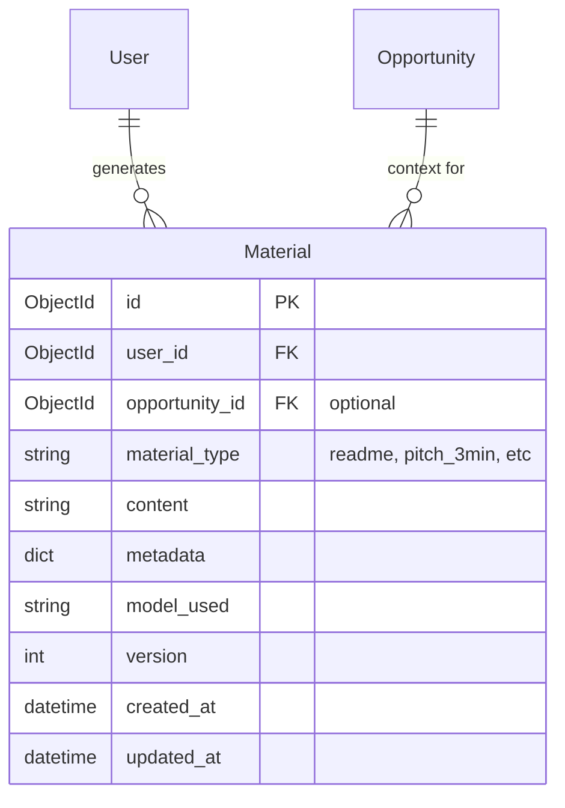

# Fix AI Generator Materials Endpoint

**Type:** fix
**Priority:** Critical
**Created:** 2026-01-05

## Overview

The AI Material Generator feature is broken due to a placeholder endpoint implementation and an architecture mismatch between SQLAlchemy services and MongoDB/Beanie models. Users cannot generate materials (README, pitch scripts, demo scripts, Q&A prep) from the Generator page.

## Problem Statement

### Current Behavior
- User navigates to `/generator` page
- User fills form and clicks "Generate Materials"
- Frontend calls `POST /api/v1/materials/generate`
- Backend returns: `{"message": "Material generation not yet implemented", "request": {...}}`
- Frontend shows nothing (no generated content)

### Expected Behavior
- Backend generates content via OpenAI
- Backend saves materials to MongoDB
- Backend returns: `{"readme_md": "...", "pitch_md": "...", "demo_script_md": "...", "qa_pred_md": "..."}`
- Frontend displays generated content with copy buttons

## Root Causes

### Issue 1: Placeholder Endpoint (Critical)
**File:** `src/opportunity_radar/api/v1/endpoints/materials.py:15-34`

```python
@router.post("/generate")
async def generate_materials(
    request: dict,  # ❌ Should use MaterialGenerateRequest schema
    current_user: User = Depends(get_current_user),
):
    # TODO: Implement AI generation service
    return {
        "message": "Material generation not yet implemented",  # ❌ Placeholder
        "request": request,
    }
```

### Issue 2: Architecture Mismatch
The `MaterialService` and `MaterialRepository` use SQLAlchemy but should use MongoDB/Beanie:

| File | Current ORM | Should Be |
|------|-------------|-----------|
| `services/material_service.py` | SQLAlchemy | MongoDB/Beanie |
| `repositories/material_repository.py` | SQLAlchemy | MongoDB/Beanie |
| `models/batch.py` | SQLAlchemy | Not needed (use Opportunity directly) |

### Issue 3: Request Schema Not Used
Endpoint accepts raw `dict` instead of typed `MaterialGenerateRequest` from `schemas/material.py`.

## Proposed Solution

### Approach: Direct Beanie Pattern (Recommended)

Follow existing endpoint patterns in the codebase (pipelines.py, matches.py):
1. Use Beanie models directly in the endpoint
2. Call the existing `MaterialGenerator` class for AI generation
3. Save results using Beanie's `Material.insert()`
4. Delete the unused SQLAlchemy-based service/repository files

### Why This Approach
- Matches existing endpoint patterns in the codebase
- `MaterialGenerator` class already works (`ai/generator.py`)
- `OpenAIClient` class already works (`ai/client.py`)
- No need to maintain legacy SQLAlchemy code

## Technical Approach

### Files to Modify

| File | Action |
|------|--------|
| `api/v1/endpoints/materials.py` | Rewrite `/generate` endpoint |
| `schemas/material.py` | Update schema with validation (minor) |

### Files to Delete (Legacy SQLAlchemy)

| File | Reason |
|------|--------|
| `services/material_service.py` | Uses SQLAlchemy, not used |
| `repositories/material_repository.py` | Uses SQLAlchemy, not used |
| `models/batch.py` | SQLAlchemy model, not used |

### Files That Already Work

| File | Status |
|------|--------|
| `models/material.py` | ✅ Beanie model, ready |
| `ai/generator.py` | ✅ MaterialGenerator, ready |
| `ai/client.py` | ✅ OpenAIClient, ready |
| `ai/prompts/templates.py` | ✅ Prompt templates, ready |

## Implementation Plan

### Phase 1: Fix the Endpoint

#### Task 1.1: Update `/generate` endpoint
**File:** `src/opportunity_radar/api/v1/endpoints/materials.py`

```python
from ....schemas.material import MaterialGenerateRequest, MaterialResponse
from ....ai.generator import get_material_generator, ProjectContext, OpportunityContext
from ....models.material import Material
from ....models.opportunity import Opportunity

@router.post("/generate", response_model=MaterialResponse)
async def generate_materials(
    request: MaterialGenerateRequest,
    current_user: User = Depends(get_current_user),
):
    """Generate materials for an opportunity using AI."""

    # Get opportunity context (optional)
    opportunity = None
    opp_context = OpportunityContext(title="General", themes=[])

    if request.opportunity_id:
        opportunity = await Opportunity.get(PydanticObjectId(request.opportunity_id))
        if opportunity:
            opp_context = OpportunityContext(
                title=opportunity.title,
                themes=opportunity.tags or [],
            )

    # Build project context
    project = ProjectContext(
        name=request.project_info.name,
        problem=request.project_info.problem,
        solution=request.project_info.solution,
        tech_stack=request.project_info.tech_stack,
        demo_url=request.project_info.demo_url,
    )

    # Generate materials
    generator = get_material_generator()
    results = await generator.generate_all(
        project=project,
        opportunity=opp_context,
        targets=request.targets,
        constraints={
            "highlight_demo": request.constraints.highlight_demo,
            "include_user_evidence": request.constraints.include_user_evidence,
            "time_limit_min": request.constraints.time_limit_min,
        }
    )

    # Build response and save materials
    response = {
        "readme_md": None,
        "pitch_md": None,
        "demo_script_md": None,
        "qa_pred_md": None,
        "metadata": {"targets": request.targets},
    }

    for target, result in results.items():
        # Save to MongoDB
        material = Material(
            user_id=current_user.id,
            opportunity_id=opportunity.id if opportunity else None,
            material_type=target,
            content=result.content,
            metadata=result.metadata,
            model_used="gpt-4o-mini",
        )
        await material.insert()

        # Map to response fields
        if target == "readme":
            response["readme_md"] = result.content
        elif target.startswith("pitch"):
            response["pitch_md"] = result.content
        elif target == "demo_script":
            response["demo_script_md"] = result.content
        elif target == "qa_pred":
            response["qa_pred_md"] = result.content

        response["metadata"][f"{target}_id"] = str(material.id)

    return response
```

#### Task 1.2: Update schema with better validation
**File:** `src/opportunity_radar/schemas/material.py`

- Add `opportunity_id` field (optional, for context)
- Ensure targets list validation
- Keep existing `ProjectInfo` and `GenerationConstraints` classes

```python
class MaterialGenerateRequest(BaseModel):
    opportunity_id: Optional[str] = None  # Changed from batch_id
    targets: List[str] = Field(
        default=["readme", "pitch_3min"],
        description="Material types: readme, pitch_1min, pitch_3min, pitch_5min, demo_script, qa_pred",
    )
    language: str = "en"
    project_info: ProjectInfo
    constraints: GenerationConstraints = Field(default_factory=GenerationConstraints)
```

### Phase 2: Clean Up Legacy Code

#### Task 2.1: Delete unused SQLAlchemy files
```bash
rm src/opportunity_radar/services/material_service.py
rm src/opportunity_radar/repositories/material_repository.py
rm src/opportunity_radar/models/batch.py
```

#### Task 2.2: Remove any imports referencing deleted files
Search and remove imports of `MaterialService`, `MaterialRepository`, `Batch` throughout codebase.

### Phase 3: Frontend Alignment

#### Task 3.1: Update frontend API call (if needed)
**File:** `frontend/services/api-client.ts`

Current call uses `batch_id`:
```typescript
generateMaterials(data: {
    batch_id: string;  // Change to opportunity_id
    ...
})
```

Update to:
```typescript
generateMaterials(data: {
    opportunity_id?: string;  // Optional
    ...
})
```

#### Task 3.2: Update generator page form
**File:** `frontend/app/(dashboard)/generator/page.tsx`

- Change `batch_id` to `opportunity_id` in mutation call
- Handle case where no opportunity is selected (generic generation)

## Acceptance Criteria

### Functional Requirements
- [ ] User can generate README content
- [ ] User can generate pitch scripts (1min, 3min, 5min)
- [ ] User can generate demo scripts
- [ ] User can generate Q&A prep materials
- [ ] Generated materials are saved to MongoDB
- [ ] User can copy generated content to clipboard
- [ ] Materials work without opportunity context (generic generation)
- [ ] Materials are personalized when opportunity is provided

### Non-Functional Requirements
- [ ] Generation completes within 60 seconds
- [ ] Proper error messages on OpenAI failures
- [ ] Request validation via Pydantic schema

### Quality Gates
- [ ] Endpoint returns correct response format
- [ ] Frontend displays generated content
- [ ] No SQLAlchemy imports remaining in materials code
- [ ] Tests pass

## Error Handling

| Scenario | Response |
|----------|----------|
| Invalid request schema | 422 Validation Error |
| Opportunity not found | Continue with generic context |
| OpenAI timeout | 503 Service Unavailable |
| OpenAI rate limit | 503 with retry message |
| OpenAI API error | 503 with generic error |
| Partial generation failure | Return successful materials, null for failed |

## Testing Plan

### Manual Testing
1. Navigate to `/generator` page
2. Fill project form with valid data
3. Select different material combinations
4. Click Generate Materials
5. Verify content appears
6. Test copy functionality
7. Check MongoDB for saved materials

### Integration Tests
```python
# tests/test_materials.py
async def test_generate_materials_success():
    response = await client.post("/api/v1/materials/generate", json={
        "targets": ["readme"],
        "project_info": {
            "name": "Test Project",
            "problem": "Test problem description",
            "solution": "Test solution description",
            "tech_stack": ["Python", "FastAPI"]
        }
    })
    assert response.status_code == 201
    assert response.json()["readme_md"] is not None

async def test_generate_materials_invalid_target():
    response = await client.post("/api/v1/materials/generate", json={
        "targets": ["invalid_type"],
        ...
    })
    assert response.status_code == 422
```

## Dependencies & Prerequisites

- [ ] OpenAI API key configured (`OPENAI_API_KEY`)
- [ ] MongoDB running and accessible
- [ ] Prompt templates exist in `ai/prompts/templates.py`

## Risks

| Risk | Mitigation |
|------|------------|
| OpenAI costs | Use gpt-4o-mini (cheaper model) |
| Slow generation | Set 60s timeout, show loading UI |
| Token limits | Truncate long inputs, handle gracefully |

## References

### Internal References
- `src/opportunity_radar/api/v1/endpoints/materials.py` - Endpoint to fix
- `src/opportunity_radar/api/v1/endpoints/pipelines.py:109-117` - Pattern for Beanie inserts
- `src/opportunity_radar/ai/generator.py` - MaterialGenerator class
- `src/opportunity_radar/ai/client.py` - OpenAI client
- `src/opportunity_radar/models/material.py` - Material Beanie model
- `src/opportunity_radar/schemas/material.py` - Request/response schemas

### External References
- [Beanie ODM Documentation](https://beanie-odm.dev)
- [FastAPI Documentation](https://fastapi.tiangolo.com)
- [OpenAI Python SDK](https://github.com/openai/openai-python)

## ERD Changes

No new models needed. Using existing `Material` model:



## Checklist

- [ ] Read and understand existing MaterialGenerator implementation
- [ ] Update `/generate` endpoint with proper schema and logic
- [ ] Update MaterialGenerateRequest schema if needed
- [ ] Test with frontend Generator page
- [ ] Delete legacy SQLAlchemy service/repository files
- [ ] Update frontend to use opportunity_id instead of batch_id
- [ ] Run full test suite
- [ ] Manual E2E testing
